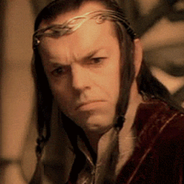

## Extending Hugo

- Modules
- Shortcodes

<div class="notes">
Extending Hugo with custom functions requires modifying the source and building it custom
</div>

## Modules

Powered by Go Modules

Most commands require Go >= 1.12

## Shortcodes

Think about them like custom elements

Only usable in Content files

Examples:

```
{}Stuff to `process` in the *center*.{}

 A bunch of code here 

```

<div class="notes">
Not usable in layout files like in themes

If you need the type of drop-in functionality that shortcodes provide but in a template, you most likely want a partial template instead.

</div>

## For the first time in my life I can walk past a balloon and it doesn’t stick to me

## I’m absolutely ex-static!



---
